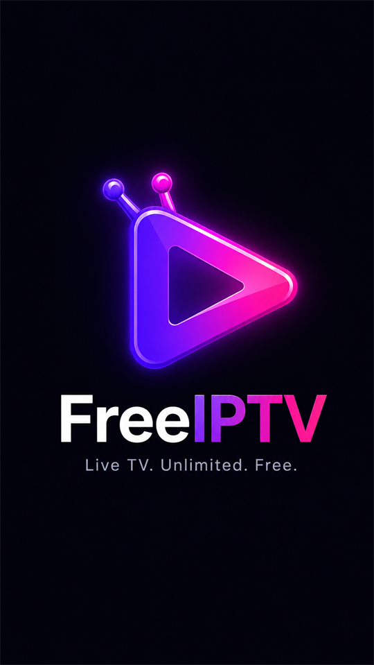

<div align="center">
  
  <h1>FreeIPTV</h1>
  <p>Stream thousands of live TV channels from around the world — completely free.</p>
</div>

---

## 📺 Overview

**FreeIPTV** is a premium, modern Android application that allows you to stream live TV channels from across the globe without any subscriptions, hidden fees, or sign-ups. Built entirely with the latest modern Android development stack (Jetpack Compose, Kotlin, and Media3 ExoPlayer), it guarantees a buttery-smooth viewing experience.

## ✨ Features

- **Massive Library:** Access thousands of live TV channels natively through M3U playlists.
- **Smart Categories:** Easily filter channels by Sports, News, Entertainment, Music, Kids, and Movies.
- **Favorites:** Save your most-watched channels for instant access later.
- **Search:** Quickly find exactly what you want to watch with the lightning-fast search engine.
- **Modern UI:** A stunning, dark-themed interface built 100% in Jetpack Compose with custom micro-animations.
- **Premium Player:** Uses AndroidX Media3 ExoPlayer for flawless, low-latency streaming and background play support.
- **Auto-Updates:** Built-in update checking to ensure you always have the latest version.

## 🛠 Tech Stack

- **Language:** [Kotlin 1.9.20](https://kotlinlang.org/)
- **UI Toolkit:** [Jetpack Compose](https://developer.android.com/jetpack/compose) (BOM `2024.04.00`)
- **Video Player:** [AndroidX Media3 ExoPlayer](https://developer.android.com/guide/topics/media/media3) `1.3.1`
- **Navigation:** [Navigation Compose](https://developer.android.com/jetpack/compose/navigation) `2.7.7`
- **Image Loading:** [Coil](https://coil-kt.github.io/coil/compose/) `2.6.0`
- **Build System:** [Gradle](https://gradle.org/) `8.6`
- **Android Gradle Plugin (AGP):** `8.3.2`

## 📱 Compatibility

- **Minimum SDK:** API 26 (Android 8.0 Oreo)
- **Target SDK:** API 36 (Android 16)

## 📥 Installation (For Users)

If you just want to use the app, you do not need to build it from source!

1. Go to the [Releases](../../releases) page of this repository.
2. Download the latest `app-release.apk` file.
3. Open the downloaded file on your Android device.
4. If prompted, allow your browser or file manager to "Install unknown apps."
5. Click **Install** and enjoy!

## 🛠️ Building from Source (For Developers)

To build the project locally, you will need [Android Studio](https://developer.android.com/studio) installed.

1. **Clone the repository:**
   ```bash
   git clone https://github.com/MdSagorMunshi/FreeIPTV.git
   cd FreeIPTV
   ```
2. **Build a Debug APK:**
   You can build a debug version directly from Android Studio or via the command line:
   ```bash
   ./gradlew assembleDebug
   ```

3. **Build a Release APK:**
   To build a signed release APK, you must first generate a keystore and configure your `local.properties` file:
   
   Generate a key:
   ```bash
   keytool -genkey -v -keystore release.keystore -alias release -keyalg RSA -keysize 2048 -validity 10000
   ```
   Add to `local.properties`:
   ```properties
   RELEASE_STORE_FILE=../release.keystore
   RELEASE_STORE_PASSWORD=your_password
   RELEASE_KEY_ALIAS=release
   RELEASE_KEY_PASSWORD=your_password
   ```
   Then run:
   ```bash
   ./gradlew assembleRelease
   ```
   The APK will be generated at `app/build/outputs/apk/release/app-release.apk`.

## 📚 Documentation & Assets

- **[Design & Image Asset Prompts](image.md):** Detailed prompts, color palettes, and specifications used to generate the premium icons, feature graphics, empty states, and onboarding illustrations for the app.

## 🤝 Contributing

Contributions are always welcome! Feel free to open an issue or submit a pull request if you have ideas for new features or bug fixes.

## 📄 License

This project is licensed under the MIT License. Copyright © 2026 Ryan Shelby. All rights reserved.
